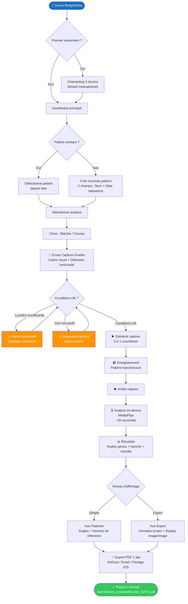
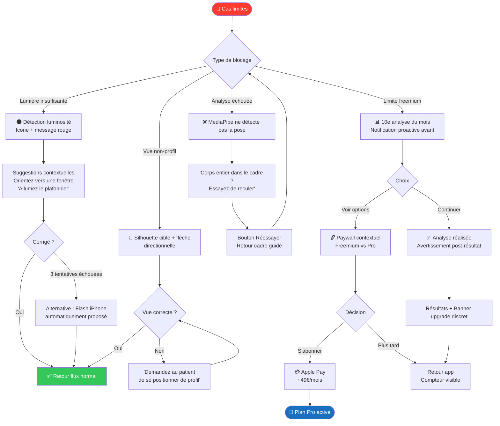
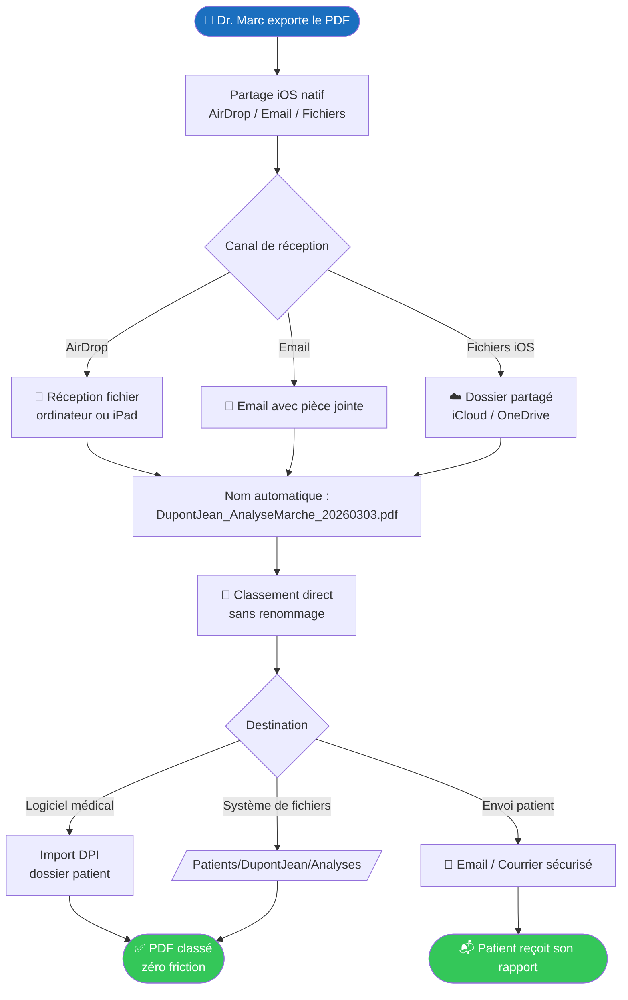
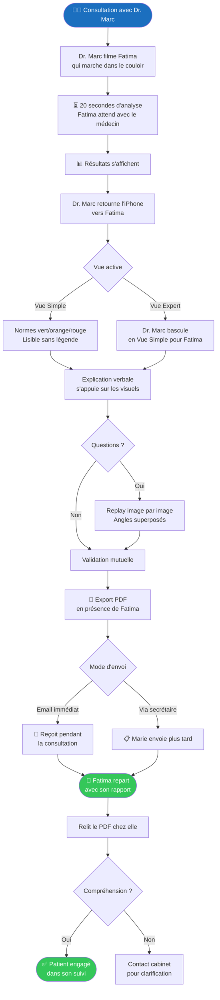

---
stepsCompleted:
  - "step-01-init"
  - "step-02-discovery"
  - "step-03-core-experience"
  - "step-04-emotional-response"
  - "step-05-inspiration"
  - "step-06-design-system"
  - "step-07-defining-experience"
  - "step-08-visual-foundation"
  - "step-09-design-directions"
  - "step-10-user-journeys"
  - "step-11-component-strategy"
  - "step-12-ux-patterns"
  - "step-13-responsive-accessibility"
  - "step-14-complete"
workflow_completed: true
completedDate: "2026-03-04"
inputDocuments:
  - "docs/planning-artifacts/prd.md"
  - "docs/planning-artifacts/product-brief-BodyOrthox-2026-03-03.md"
  - "docs/planning-artifacts/research/technical-bodyorthox-stack-research-2026-03-02.md"
  - "docs/planning-artifacts/prd-validation-report.md"
  - "docs/brainstorming/brainstorming-session-2026-03-02-1930.md"
project_name: BodyOrthox
author: Karimmeguenni-tani
date: "2026-03-03"
mockupTool: "Google Stitch"
---

# UX Design Specification — BodyOrthox

**Auteur :** Karimmeguenni-tani
**Date :** 2026-03-03

---

<!-- UX design content will be appended sequentially through collaborative workflow steps -->

## Executive Summary

### Project Vision

BodyOrthox est une application mobile et web (React Native) qui permet aux orthopédistes d'analyser objectivement la biomécanique de leurs patients — marche et course — en 30 secondes, depuis n'importe quel cabinet, avec uniquement leur iPhone. L'analyse (genou, hanche, cheville) est réalisée 100% on-device via MediaPipe (97.2% PCK), sans transmission de données vidéo, sans matériel dédié, à ~39-49€/mois. Architecture locale-first = conformité RGPD native.

**Proposition de valeur centrale :** Là où Kinetisense/Dartfish coûtent 3-15k€/an avec matériel obligatoire, BodyOrthox offre une analyse clinique portable, opérable seul, en 30 secondes — "le prix d'un abonnement, sur votre iPhone."

**Outil de mockup :** Google Stitch

### Target Users

| Persona                                     | Rôle                   | Nature de l'interaction                                                     |
| ------------------------------------------- | ---------------------- | --------------------------------------------------------------------------- |
| **Dr. Marc** — orthopédiste libéral, 42 ans | Utilisateur principal  | Flux complet 4 taps : filme → analyse → exporte                             |
| **Marie** — secrétaire médicale             | Utilisateur secondaire | Reçoit uniquement le PDF nommé automatiquement, sans interaction avec l'app |
| **Fatima** — patiente, 58 ans               | Utilisateur indirect   | Voit l'écran lors de la consultation, reçoit le PDF patient par email       |

**Contexte d'usage Dr. Marc :** 1 consultation sur 3 nécessite une analyse biomécanique. Seul dans son cabinet, sans assistant technique, entre deux examens. Critère d'adoption : "ça marche la première fois, sans explication."

### Key Design Challenges

**1. La confiance en 30 secondes** — Le moment "aha" (voir les angles articulaires s'afficher sans rien configurer) doit arriver immédiatement et sans friction. Le moindre blocage, friction ou question technique = abandon. L'onboarding doit montrer la destination avant les boutons.

**2. Le guidage caméra en conditions réelles** — Luminosité faible (néons cabinet), vêtements sombres, espace limité, patient qui bouge. Le cadre visuel doit guider et rassurer sans expliquer — comme un scanner de document bancaire. Bonne luminosité = cadre vert ; insuffisante = cadre orange avec instruction simple.

**3. Lisibilité médicale vs simplicité patient** — Une même analyse doit servir deux niveaux de lecture : le praticien (chiffres, normes, annotations) et le patient (silhouette, langage naturel). L'interface deux niveaux (simple / expert) doit basculer en 1 tap, sans jamais perdre l'utilisateur.

### Design Opportunities

**1. L'analyse silencieuse comme superpower** — Le traitement ML tourne en arrière-plan pendant que le médecin parle au patient. Cette contrainte technique (traitement post-capture) devient une opportunité UX : transformer un temps d'attente passif en temps médical actif. La notification "Analyse prête — 42°/67°/41°" devient un moment de révélation.

**2. Le rapport comme pont de communication** — Au-delà de l'export PDF, le rapport peut devenir un outil de dialogue praticien-patient en consultation (vue annotation expert, comparaison silhouette) et un outil de coordination médecin-kiné (document commun de référence). La valeur du rapport dépasse son rôle de documentation.

**3. RGPD by UX** — Chaque contrainte réglementaire peut devenir un moment de confiance : script de réassurance intégré avant capture ("cette vidéo reste sur votre appareil"), suppression vidéo proposée automatiquement après analyse, confirmation visuelle. La conformité devient argument de vente, pas coût de conformité.

## Core User Experience

### Defining Experience

L'expérience core de BodyOrthox est un flux linéaire de 4 taps :
Nouveau patient → Filmer → Résultat → Exporter.

Ce flux doit être maîtrisable sans formation, réalisable en 30 secondes, et produire un résultat cliniquement lisible au premier essai. La différenciation de BodyOrthox est dans l'expérience, pas dans le volume de features.

**Règle directrice :** Si une décision UX ralentit ce flux ou crée une question dans la tête du praticien, elle est mauvaise.

### Platform Strategy

- **Plateforme :** iOS + Android + Web (iPhone + iPad + navigateurs), MVP distribué via TestFlight
- **Mode d'interaction :** Tactile, une main (iPhone portrait), en position debout
- **Offline-first :** 100% — aucune connexion réseau requise à aucun moment
- **Capture caméra :** Caméra arrière uniquement, vue de profil strict du patient
- **Capacités exploitées :** Face ID/Touch ID (react-native-biometrics), Local Notifications (@notifee/react-native), Share Sheet natif, In-App Purchase (react-native-purchases / RevenueCat), react-native-reanimated (animations fluides)
- **Mockup tool :** Google Stitch

### Effortless Interactions

| Interaction      | Ce qui doit être invisible                                                 |
| ---------------- | -------------------------------------------------------------------------- |
| Guidage caméra   | Cadre visuel couleur (vert/orange) — aucune instruction textuelle          |
| Traitement ML    | Analyse en arrière-plan, notification discrète — pas d'écran de chargement |
| Export PDF       | 1 tap → share sheet iOS → AirDrop/email — nommage automatique              |
| Accès sécurisé   | Face ID au démarrage — pas d'auth propriétaire                             |
| Upgrade freemium | Compteur visible + offre contextuelle uniquement quand limite atteinte     |

### Critical Success Moments

**Moment 1 — Le premier résultat (J+0)**
Le praticien voit ses premiers angles articulaires s'afficher sans avoir rien configuré. C'est le moment "ça marche vraiment." Si ce moment rate (ML échoue, temps > 30s, interface confuse), l'adoption ne se produira pas.

**Moment 2 — La limite freemium (J+21)**
Le praticien atteint 10/10 analyses. Il voit son historique (preuve que l'outil a fonctionné). L'offre d'upgrade apparaît avec contexte. Il a déjà la preuve — l'upgrade est logique, pas une demande.

**Moment 3 — Le PDF reçu par Marie (J+1)**
La secrétaire reçoit le fichier correctement nommé, sans manipulation. Elle ne rappelle pas le médecin. Si elle doit renommer ou reformater, elle devient frein passif à l'adoption.

### Experience Principles

1. **Zéro décision cognitive dans le flux** — Chaque écran du flux 4 taps n'a qu'une action principale visible. Le praticien avance, ne choisit pas.

2. **Le résultat avant les instructions** — L'onboarding montre ce que l'app produit avant d'expliquer comment l'utiliser. La motivation précède la formation.

3. **Les contraintes deviennent des features** — RGPD (script réassurance), offline (zéro latence réseau), post-capture (temps médical récupéré) : chaque limite technique est présentée comme avantage.

4. **Deux niveaux de lecture, un seul document** — Le même rapport sert le praticien (chiffres, annotations) et le patient (silhouette, langage naturel). Bascule en 1 tap.

## Desired Emotional Response

### Primary Emotional Goals

**Émotion primaire : La confiance instantanée**
Dr. Marc doit ressentir "ça marche, vraiment" au premier résultat. Pas de surprise, pas de doute — une confirmation que son intuition clinique est maintenant objectivée. C'est l'émotion qui déclenche l'adoption et qui différencie BodyOrthox de tout ce qu'il a essayé avant.

**Émotion secondaire : La compétence augmentée**
L'app ne remplace pas son jugement clinique — elle l'amplifie. Il doit se sentir plus capable, pas dépendant d'un outil. "J'utilise BodyOrthox" et non "BodyOrthox travaille à ma place."

### Emotional Journey Mapping

| Moment                   | Émotion cible                                                      | Émotion à éviter          |
| ------------------------ | ------------------------------------------------------------------ | ------------------------- |
| **Découverte (congrès)** | Curiosité + légère incrédulité ("vraiment sans matériel ?")        | Méfiance technologique    |
| **Premier lancement**    | Anticipation + sécurité (l'onboarding montre la destination)       | Anxiété ("je vais rater") |
| **Guidage caméra**       | Contrôle + confiance (cadre vert = je suis au bon endroit)         | Confusion, frustration    |
| **Attente analyse**      | Calme productif (je parle à mon patient pendant ce temps)          | Impatience, incertitude   |
| **Premier résultat**     | Émerveillement + validation ("c'est exactement ce que je sentais") | Déception, doute          |
| **Export PDF**           | Efficacité + fierté (rapport professionnel en 1 tap)               | Friction, honte du format |
| **Limite freemium**      | Légitimité de l'upgrade ("j'ai eu la preuve, ça vaut 39€")         | Sentiment de manipulation |
| **Usage récurrent**      | Naturalité + habitude ("je n'y réfléchis plus")                    | Dépendance ressentie      |

### Micro-Emotions

- **Confiance > Scepticisme** — Le praticien ne fait pas confiance aux IA médicales par défaut. Chaque détail (disclaimer clair, score de confiance ML visible, formulations "documenter" et non "diagnostiquer") construit une confiance progressive.

- **Accomplissement > Frustration** — Chaque tap doit avancer. Pas de dead-end, pas d'écran vide, pas de spinner sans fin. Le progrès doit être visible à chaque étape.

- **Délight > Simple satisfaction** — Le nommage automatique du PDF, la notification discrète "Analyse prête — 42°/67°/41°", les angles superposés au replay : ces micro-moments vont au-delà du fonctionnel — ils créent la mémorabilité.

- **Sécurité > Anxiété (données)** — Le script RGPD intégré et la suppression vidéo proposée ne doivent pas créer de l'anxiété mais la dissoudre. Ton : rassurant et factuel, pas alarmiste.

### Design Implications

- **Confiance → Feedback visuel immédiat et précis** : le cadre caméra répond en temps réel (< 100ms). Le score de confiance ML est affiché, pas caché. Le disclaimer est sobre, pas intrusif.

- **Compétence augmentée → Interface deux niveaux** : la vue "simple" par défaut montre ce que le praticien comprend intuitivement. La vue "expert" est disponible, pas imposée.

- **Calme productif → Analyse silencieuse** : pas de modal bloquant, pas d'écran de chargement en plein écran. Une bannière discrète + notification locale suffisent.

- **Délight → Micro-animations react-native-reanimated** : transitions fluides 60 FPS, animation d'apparition des angles articulaires, cadre qui pulse doucement quand il est en position correcte.

- **Naturalité récurrente → Zéro re-onboarding** : l'app mémorise le dernier patient actif, le dernier type d'analyse. Le praticien reprend exactement où il s'était arrêté.

### Emotional Design Principles

1. **Montrer avant d'expliquer** — Chaque moment de doute se dissipe par une démonstration, pas une instruction. L'écran d'onboarding montre un vrai rapport avant de montrer les boutons.

2. **Le feedback rassure, il ne juge pas** — Cadre orange = "ajustez la lumière", pas "mauvaise capture". Confiance ML faible = "correction disponible", pas "analyse invalide". Le ton est celui d'un assistant, pas d'un juge.

3. **Le médecin reste l'expert** — L'app documente ce que le praticien observe. Formulations toujours : "vous observez", "vos données indiquent", jamais "l'app a détecté", "l'IA a diagnostiqué".

4. **La discrétion est du respect** — En consultation, l'app doit s'effacer. Pas de notifications intempestives, pas d'animations distrayantes, pas de badges rouges anxiogènes. La seule animation qui compte, c'est le résultat qui apparaît.

## UX Pattern Analysis & Inspiration

### Inspiring Products Analysis

#### Doctolib

Référence de flux médical linéaire dans le contexte français. Dr. Marc l'utilise probablement quotidiennement.

**Forces UX extraites :**

- Flux de prise de RDV en étapes strictement séquentielles, aucune bifurcation dans le chemin principal
- La confiance se construit avant l'action (contexte visible dès la liste) — pas après
- Onboarding par l'usage : l'utilisateur "apprend" l'app en accomplissant son objectif réel
- Confirmation multi-canal sans redondance anxiogène

#### Stripe (Dashboard iOS)

Référence de visualisation de données professionnelles en contexte mobile.

**Forces UX extraites :**

- Hiérarchie visuelle : 1 grand chiffre dominant → contexte → détail. L'essentiel visible en 1 seconde.
- Feedback d'état immédiat et sans ambiguïté : vert/rouge, libellés courts, icônes reconnaissables
- Complexité cachée : interface simple en surface, profondeur accessible via navigation contextuelle (pas imposée)
- Précision comme vecteur de confiance : chaque donnée est sourcée et horodatée

### Transferable UX Patterns

**Patterns de navigation :**

- **Flux linéaire Doctolib** → Appliquer au flux 4 taps BodyOrthox : chaque écran = 1 étape = 1 action principale. Pas de menu latéral, pas d'onglets dans le flux de capture.
- **Navigation contextuelle Stripe** → Vue simple par défaut, vue expert accessible en 1 tap depuis le résultat. La profondeur ne s'impose pas, elle s'offre.

**Patterns d'interaction :**

- **Cadre guidé iOS Camera / Scanner Pro** → Adapter le pattern "rectangle vert = bien positionné" pour le guidage de profil strict patient. Feedback couleur (vert/orange) sans texte d'instruction dans le flux.
- **Confirmation Stripe** → Appliquer à la notification post-analyse : "Analyse prête — 42° / 67° / 41°" — les chiffres clés dans la notif, pas juste "votre analyse est prête."

**Patterns visuels :**

- **Hiérarchie Stripe** → Page résultat BodyOrthox : 1 angle dominant (articulation principale) → comparaison norme → détail des 3 articulations → replay expert. Du général au particulier.
- **Confiance par contexte Doctolib** → Chaque résultat affiché avec sa norme de référence ("Flexion genou : 42° / Norme 60-70° pour 67 ans"). Le praticien voit l'écart sans calculer.

### Anti-Patterns to Avoid

- **L'écran d'accueil surchargé** — Pas de dashboard avec widgets, stats et raccourcis simultanés. Un seul CTA en home : "Nouvelle analyse".
- **La complexité exposée** — Ne pas reproduire Kinetisense/Dartfish qui exposent leurs paramètres. BodyOrthox cache tout ce qui n'est pas utile dans le flux principal.
- **Le spinner bloquant** — Ni Doctolib ni Stripe ne bloquent l'interface pendant un traitement. Pas d'écran de chargement plein écran pour l'analyse ML — bannière discrète + notification locale uniquement.
- **Le modal de confirmation inutile** — Éviter "Êtes-vous sûr de vouloir exporter ?" Le share sheet iOS est lui-même une confirmation suffisante.

### Design Inspiration Strategy

**À adopter directement :**

- Flux 100% linéaire sans bifurcation (Doctolib) pour les 4 taps du flux principal
- Hiérarchie visuelle 1 grand chiffre + contexte normatif (Stripe) pour la page résultat
- Feedback couleur immédiat sans texte (Camera iOS) pour le guidage caméra

**À adapter :**

- Confirmation multi-canal Doctolib → Adapter en notification locale seule (offline-first) + libellé avec valeurs réelles ("42°/67°/41°")
- Complexité cachée Stripe → Adapter avec bascule "vue simple / vue expert" en 1 tap (pas de navigation imbriquée)

**À éviter absolument :**

- Tout pattern qui expose des paramètres dans le flux de capture
- Tout écran de chargement bloquant
- Tout dashboard multi-widgets en page d'accueil
- Toute demande de confirmation superflue avant export

## Design System Foundation

### Design System Choice

**Approche retenue : React Native Components + Design System Custom**

Navigation via React Navigation (native-stack) ; composants UI custom avec l'identité visuelle BodyOrthox, adaptés à chaque plateforme (iOS + Android + Web).

### Rationale for Selection

- **React Navigation pour la navigation** : swipe-back natif iOS, bottom sheets, native-stack navigation — Dr. Marc reconnaît chaque geste. La confiance passe par la familiarité.
- **React Native components custom** : composants stylés avec le design system BodyOrthox (View, Text, Pressable, TextInput) — adaptables iOS, Android et Web.
- **Design tokens → identité BodyOrthox** : colorScheme, typography, shape system personnalisés pour une identité médicale professionnelle distincte.
- **Solo developer** : gain de temps maximal avec react-native-web pour couvrir 3 plateformes sans sacrifier le feel natif que la cible utilise quotidiennement.

### Implementation Approach

- `NavigationContainer` comme composant racine avec native-stack navigation
- Navigation : native-stack navigation + swipe-back natif sur tout le flux 4 taps
- Composants système : ActionSheet (React Native) (share), Alert (React Native) (permissions), React Navigation header
- Composants UI : design system custom — `View` avec shadow (cards), `Pressable` stylé (boutons), progress bars custom, `BottomSheet`
- Animations : react-native-reanimated — 60 FPS sur toutes les plateformes

### Customization Strategy

| Token                      | Valeur cible                        | Rationale                                        |
| -------------------------- | ----------------------------------- | ------------------------------------------------ |
| **ColorScheme**            | Bleu médical sobre + blanc dominant | Crédibilité médicale, lisibilité en cabinet      |
| **Typography**             | SF Pro (iOS natif)                  | Cohérence système, lisibilité chiffres cliniques |
| **Shape**                  | Radius modéré (8-12px)              | Professionnel sans être froid                    |
| **Feedback couleurs**      | Vert `#34C759` / Orange `#FF9500`   | Couleurs système iOS — cadre caméra guidé        |
| **Éléments ML confidence** | Gradient vert→rouge                 | Niveau de confiance intuitivement lisible        |

## 2. Core User Experience

### 2.1 Defining Experience

**"Filme la marche de ton patient. Vois les angles articulaires apparaître en 30 secondes."**

C'est l'expérience fondamentale de BodyOrthox. Tout le reste — gestion patients, historique, freemium, rapport PDF — est infrastructure au service de ce moment. Si ce moment est parfait, BodyOrthox est adopté.

Comme Tinder a réduit la rencontre à "swipe", BodyOrthox réduit l'analyse biomécanique à "filme → angles". La description que Dr. Marc fera à son confrère sera exactement ça — pas la stack technique.

### 2.2 User Mental Model

**Modèle mental actuel de Dr. Marc :**

- Il filme déjà avec son iPhone (vidéos du quotidien)
- Il connaît le pattern "pointer l'appareil → cadre → capturer"
- Il utilise Doctolib, WhatsApp, des apps iOS du quotidien
- Il attend que l'app fonctionne comme les autres apps iOS — pas qu'elle lui demande d'apprendre quelque chose de nouveau

**Ce qu'il comprend intuitivement :**

- Cadre vert = go (comme la caméra iOS)
- Spinner = attente (comme n'importe quelle app)
- Chiffre + couleur = résultat (comme Stripe, la météo, Santé iOS)

**Où il peut bloquer :**

- "Vue de profil strict" → guidage visuel obligatoire, pas textuel
- "Analyse post-capture" → la notification résout l'attente sans expliquer
- "Confiance ML faible" → score affiché sans alarmer ni décourager

**Métaphore mentale visée :** L'app Caméra iOS. On pointe, le cadre s'ajuste, on capture. Aucune question, aucun paramètre. Le résultat arrive.

### 2.3 Success Criteria

| Critère              | Signal de succès                                              |
| -------------------- | ------------------------------------------------------------- |
| **Vitesse**          | Du tap "Nouvelle analyse" aux angles affichés : ≤ 30 secondes |
| **Clarté immédiate** | Dr. Marc comprend le résultat sans lire la documentation      |
| **Fiabilité**        | Cadre vert → analyse réussie dans 95%+ des cas                |
| **Zéro question**    | Aucun écran ne génère de doute sur "que dois-je faire ici ?"  |
| **Mémorabilité**     | Dr. Marc décrit l'expérience à un confrère le lendemain       |

**Signal ultime :** Dr. Marc filme son deuxième patient sans avoir regardé l'écran d'aide ou contacté le support.

### 2.4 Novel UX Patterns

**Patterns établis réutilisés (zéro éducation nécessaire) :**

- Cadre caméra couleur → universellement compris depuis l'app iOS Camera
- Notification "résultat prêt" → pattern push notification universel
- Share sheet iOS → mécanisme de partage que Dr. Marc utilise depuis des années

**Combinaison innovante (familier + inattendu) :**

- Le guidage caméra médical (vue profil strict) emballé dans le pattern "cadre vert/orange" — familier dans la forme, nouveau dans le fond.
- L'analyse silencieuse + notification avec angles dans le texte ("42°/67°/41°") — combinaison inédite qui transforme l'attente en anticipation.

**Pattern vraiment nouveau à enseigner :**

- "Vue de profil strict" — l'onboarding wizard (écran 2/3) montre une illustration de la bonne position. Une seule fois, mémorisé définitivement.

### 2.5 Experience Mechanics

**1. Initiation — "Tap Nouvelle analyse"**

- Home screen : 1 seul CTA dominant "Nouvelle analyse"
- Patient existant : sélection dans liste (recherche + recents)
- Nouveau patient : nom + date de naissance (2 champs, clavier iOS)
- Résultat : 1-2 taps, praticien en position de filmer

**2. Guidage caméra — "Le cadre parle"**

- Plein écran caméra avec overlay rectangle
- `#34C759` (vert) : bonne luminosité, bon angle → "Filmez" + haptic léger
- `#FF9500` (orange) : correction nécessaire → instruction ≤ 5 mots
- Bouton "Démarrer" n'apparaît qu'en état vert → empêche les captures ratées
- Script RGPD : 1 ligne sobre en haut, lu avant de filmer

**3. Capture — "12 secondes, il marche"**

- Barre de progression discrète en bas (durée recommandée 8-15s)
- Bouton "Arrêter" toujours visible
- Aucune autre interaction disponible — focus total

**4. Analyse silencieuse — "Il parle à son patient"**

- Transition vers écran patient libre
- Bannière discrète : "Analyse en cours..."
- ML tourne en native thread / Web Worker — UI non bloquée
- Notification locale : "Analyse prête — Genou 42°/67° · Hanche 89° · Cheville 41°"

**5. Résultat — "Le moment aha"**

- 1 articulation dominante (écart le plus significatif en premier)
- Tableau : valeur mesurée + norme âge + indicateur vert/orange/rouge
- Bascule "Vue simple / Vue expert" en 1 tap
- Vue expert : replay image par image avec angles superposés

**6. Export — "1 tap, c'est fait"**

- Bouton "Exporter" proéminent
- Share sheet iOS natif → AirDrop / email / autres apps
- Nom automatique : `Martin_Paul_AnalyseMarche_2026-03-03.pdf`
- La share sheet est la confirmation — pas de modal supplémentaire

## Visual Design Foundation

### Color System

**Philosophie couleur : "Clarté clinique"**
Blanc dominant + bleu médical sobre + accents fonctionnels. Le blanc crée l'espace de lecture pour les chiffres cliniques. Le bleu ancre la crédibilité médicale sans tomber dans le corporate. Les accents sont fonctionnels — ils communiquent un état, pas une décoration.

**Palette principale :**

| Rôle               | Couleur         | Hex       | Usage                                        |
| ------------------ | --------------- | --------- | -------------------------------------------- |
| **Primary**        | Bleu médical    | `#1B6FBF` | CTAs, liens, accents actifs                  |
| **Primary Light**  | Bleu clair      | `#E8F1FB` | Backgrounds cards résultat, surfaces actives |
| **Background**     | Blanc pur       | `#FFFFFF` | Fond principal — lisibilité maximale         |
| **Surface**        | Gris très clair | `#F2F2F7` | Fond listes, sections groupées (iOS system)  |
| **On-Surface**     | Gris foncé      | `#1C1C1E` | Texte principal (iOS system label)           |
| **Secondary text** | Gris moyen      | `#8E8E93` | Labels secondaires, normes de référence      |

**Accents fonctionnels (états) :**

| Rôle                    | Couleur    | Hex       | Usage                                  |
| ----------------------- | ---------- | --------- | -------------------------------------- |
| **Success / Normal**    | Vert iOS   | `#34C759` | Cadre caméra OK, valeur dans norme     |
| **Warning / Limite**    | Orange iOS | `#FF9500` | Cadre caméra à corriger, valeur limite |
| **Error / Hors norme**  | Rouge iOS  | `#FF3B30` | Valeur hors plage normative            |
| **Confidence High**     | Vert       | `#34C759` | Score ML > 85%                         |
| **Confidence Low**      | Orange     | `#FF9500` | Score ML 60-85%                        |
| **Confidence Critical** | Rouge      | `#FF3B30` | Score ML < 60% → correction manuelle   |

**Note :** Utiliser les couleurs système iOS (`systemGreen`, `systemOrange`, `systemRed`) — adaptation automatique au mode sombre si activé.

**Accessibilité :**

- Primary `#1B6FBF` sur fond blanc : ratio 5.4:1 → WCAG AA ✅
- Texte principal `#1C1C1E` sur blanc : ratio 19:1 → WCAG AAA ✅
- Accents fonctionnels utilisés toujours avec icône ou texte (jamais couleur seule) → daltonisme pris en compte

### Typography System

**Police : SF Pro (iOS natif)**
Pas de font custom — SF Pro est optimisée pour la lisibilité des chiffres médicaux sur écran rétina. Dr. Marc la lit sur son iPhone toute la journée — zéro friction cognitive.

**Hiérarchie typographique :**

| Niveau          | Style iOS  | Taille | Poids    | Usage                          |
| --------------- | ---------- | ------ | -------- | ------------------------------ |
| **Large Title** | largeTitle | 34pt   | Regular  | Titre page résultat            |
| **Title 1**     | title      | 28pt   | Semibold | Valeur angulaire dominante     |
| **Title 2**     | title2     | 22pt   | Regular  | Nom patient, section headers   |
| **Headline**    | headline   | 17pt   | Semibold | Labels articulations, CTAs     |
| **Body**        | body       | 17pt   | Regular  | Texte principal, normes        |
| **Callout**     | callout    | 16pt   | Regular  | Instructions caméra (≤ 5 mots) |
| **Caption**     | caption    | 12pt   | Regular  | Métadonnées, disclaimer        |

**Règle clé :** Les angles articulaires (ex: "42°") sont affichés en Title 1 Semibold — hiérarchie Stripe appliquée aux données médicales.

### Spacing & Layout Foundation

**Unité de base : 8pt (iOS standard)**

| Usage                              | Valeur      |
| ---------------------------------- | ----------- |
| Padding interne card               | 16pt        |
| Marge horizontale écran            | 16pt        |
| Espacement entre sections          | 24pt        |
| Espacement entre éléments de liste | 8pt         |
| Zone tactile minimum               | 44pt × 44pt |
| Border radius cards                | 12pt        |
| Border radius boutons              | 10pt        |

**Layout principles :**

1. **Une colonne, toujours** — données médicales lues de haut en bas, pas en grille
2. **Thumb zone prioritaire** — CTAs principaux dans le tiers inférieur (zone pouce)
3. **Respiration entre sections** — 24pt minimum entre blocs ; le blanc est de l'information

### Accessibility Considerations

- **Dynamic Type** : toutes les tailles en TextStyle iOS natif → scaling automatique
- **Contraste** : ratio minimum 4.5:1 pour tout texte (WCAG AA)
- **Couleur non-exclusive** : chaque état (vert/orange/rouge) accompagné d'une icône SF Symbol et d'un label
- **Zone tactile** : minimum 44×44pt sur tous les éléments interactifs
- **Reduce Motion** : animations désactivables — fallback statique pour les transitions critiques
- **VoiceOver** : labels sémantiques sur angles ("Flexion genou gauche : 42 degrés, sous la norme de 60 à 70 degrés")

## Design Direction Decision

### Design Directions Explored

6 directions visuelles explorées via showcase interactif (`docs/planning-artifacts/ux-design-directions.html`) :

- A — Clinical White (iOS natif, blanc dominant)
- B — Dark Professional (mode sombre, données en vedette)
- C — Warm Clinical (vert médical, chaleureux)
- D — Bold Data (chiffres géants, style Stripe)
- E — Pure Cupertino (indiscernable d'une app Apple)
- F — Confident Blue (header bleu arrondi, fond bleu pâle)

### Chosen Direction

**Direction A — Clinical White**

iOS natif, fond blanc dominant, couleurs fonctionnelles uniquement. Chaque élément justifie sa présence. Esthétique Santé iOS — immédiatement reconnu et fait confiance par Dr. Marc.

**Écrans clés retenus :**

- Home : CTA "Nouvelle analyse" dominant + liste patients épurée + Bottom Tab Navigator
- Capture : plein écran, bannière RGPD légère, bouton "Prendre une photo" (pivot HKA — 08/03/2026)
- Résultats : card Angle HKA dominant + BodySkeletonOverlay axe H-K-A + normes genu varum/valgum (pivot HKA — 08/03/2026)

---

### Mockups Stitch — Inventaire

> Projet Stitch : **BodyOrthox Home** (ID `4499963344980375656`)
> Dossier local : `docs/planning-artifacts/stitch-mockups/`

#### Écrans actifs (post-pivot HKA — 08/03/2026)

| #   | Titre Stitch                                                  | Screenshot                                     | HTML interactif                          | Stories        |
| --- | ------------------------------------------------------------- | ---------------------------------------------- | ---------------------------------------- | -------------- |
| 01  | Home — liste patients + CTA                                   | `screenshots/01-home.png`                      | `html/01-home.html`                      | Story 2.2      |
| 06  | Nouveau patient — variante A                                  | `screenshots/06-nouveau-patient-a.png`         | `html/06-nouveau-patient-a.html`         | Story 2.1      |
| 07  | Nouveau patient — variante B                                  | `screenshots/07-nouveau-patient-b.png`         | `html/07-nouveau-patient-b.html`         | Story 2.1      |
| 09  | Capture Photo HKA                                             | `screenshots/09-capture-photo-hka.png`         | `html/09-capture-photo-hka.html`         | Story 3.0      |
| 10  | Onboarding 1/3 — Démo HKA (vue frontale anatomique)           | `screenshots/10-onboarding-1-3-hka.png`        | `html/10-onboarding-1-3-hka.html`        | Story 6.1      |
| 11  | Onboarding 3/3 — Export sécurisé HKA                          | `screenshots/11-onboarding-3-3-export-hka.png` | `html/11-onboarding-3-3-export-hka.html` | Story 4.2, 6.1 |
| 12  | Résultats Analyse HKA (174.2°, Genu varum, axe H-K-A, normes) | `screenshots/12-resultats-hka.png`             | `html/12-resultats-hka.html`             | Story 3.4      |

#### Écrans dépréciés (pré-pivot — vidéo sagittale)

| #   | Titre                                     | Raison                                             |
| --- | ----------------------------------------- | -------------------------------------------------- |
| 02  | Generated Screen A (capture vidéo guidée) | Pipeline vidéo supprimé — sprint change 08/03/2026 |
| 03  | Generated Screen B (capture vidéo)        | Pipeline vidéo supprimé                            |
| 04  | Analysis Results (angles sagittaux)       | Remplacé par analyse HKA                           |
| 05  | Résultats d'analyse (angles multiples)    | Remplacé par analyse HKA                           |
| 08  | Onboarding 1/3 (démo marche)              | Remplacé par démo HKA frontale                     |

### Design Rationale

- **Confiance immédiate** : Dr. Marc reconnaît l'esthétique de l'app Santé iOS — pas de temps d'adaptation visuelle
- **Lisibilité clinique maximale** : fond blanc pur + SF Pro + chiffres en Title 1 Semibold → angles articulaires lisibles en 1 seconde, même sous lumière néon de cabinet
- **Discrétion en consultation** : l'interface s'efface derrière le contenu médical — aucune couleur décorative ne distrait
- **Cohérence émotionnelle** : Clinical White supporte "compétence augmentée" et "discrétion = respect"

### Implementation Approach

- React Navigation header pour toutes les nav bars
- Bottom Tab Navigator pour la tab bar principale
- Cards résultat en `View` avec shadow custom (elevation 0, border radius 12pt)
- Couleurs système iOS (`systemGreen`, `systemOrange`, `systemRed`) pour les états articulaires
- Background principal : `#F2F2F7` (iOS systemGroupedBackground)
- Cards : `#FFFFFF` (iOS secondarySystemGroupedBackground)
- CTA principal "Nouvelle analyse" : `#1B6FBF` full-width, border radius 14pt

## User Journey Flows

### Journey 1 — Dr. Marc : Le Premier Résultat (Happy Path)

Le flux fondamental de BodyOrthox : 4 taps, 30 secondes, du démarrage à l'envoi du rapport.



**Points de valeur clés :**

- Tap 1 : Sélection/création patient — 2 champs maximum
- Tap 2 : Lancement capture — guidage automatique par le cadre
- Tap 3 : Arrêt + déclenchement analyse — 20 secondes d'attente transparente
- Tap 4 : Export PDF — share sheet iOS natif

---

### Journey 2 — Dr. Marc : Capture Difficile + Upgrade Freemium

Les deux cas limites critiques : conditions non-optimales et limite du plan gratuit.



**Principes UX pour les cas limites :**

- Jamais un blocage sec : chaque erreur propose une action corrective immédiate
- Guidage progressif avant upgrade forcé — l'utilisateur n'est jamais puni
- Le paywall apparaît comme une libération, pas une punition

---

### Journey 3 — Marie la Secrétaire : Le PDF Parfait

Marie ne touche jamais l'app. Son journey commence quand Dr. Marc a exporté.



**Contrainte critique :** Le nom `NomPrenom_AnalyseMarche_DATE.pdf` doit être exact dès la première réception. Marie ne doit jamais renommer un fichier — si elle le fait, elle devient frein passif à l'adoption.

---

### Journey 4 — Fatima : Comprendre Son Corps

Fatima est présente pendant la consultation. Elle voit l'écran, entend l'explication, reçoit le PDF.



**Insight UX clé :** Fatima ne choisit jamais l'app, mais son expérience de l'écran et du PDF conditionne sa confiance dans le médecin et son adhésion au traitement. La double lisibilité (praticien / patient) est non négociable.

---

### Journey Patterns

Patterns récurrents identifiés à travers les 4 journeys.

#### Navigation Patterns

| Pattern                    | Description                                                              | Journeys |
| -------------------------- | ------------------------------------------------------------------------ | -------- |
| **Progressive Disclosure** | Complexité cachée jusqu'à activation explicite (Vue Simple → Vue Expert) | J1, J4   |
| **Guided Positioning**     | Cadre visuel + instructions textuelles pour corriger la position         | J1, J2   |
| **Contextual Paywall**     | Upgrade proposé au moment précis de la friction, jamais avant            | J2       |

#### Decision Patterns

| Pattern                    | Description                                                       | Journeys |
| -------------------------- | ----------------------------------------------------------------- | -------- |
| **Always-an-Exit**         | Chaque erreur propose une sortie + une action corrective          | J2       |
| **Confirmatory Feedback**  | Succès explicitement confirmé (couleurs + animation) avant export | J1       |
| **Zero-Rename Convention** | Nomenclature automatique du fichier pour éliminer les décisions   | J3       |

#### Feedback Patterns

| Pattern                   | Description                                                | Journeys |
| ------------------------- | ---------------------------------------------------------- | -------- |
| **Ambient Progress**      | Analyse silencieuse avec indicateur discret (~20 secondes) | J1       |
| **Traffic Light Norming** | Vert/orange/rouge immédiatement lisible sans légende       | J1, J4   |
| **Recovery Prompts**      | Message d'erreur = instruction corrective immédiate        | J2       |

---

### Flow Optimization Principles

1. **Valeur avant configuration** — L'analyse peut être lancée sans compte, sans réglage. La valeur précède la friction.
2. **Échec gracieux** — Toute erreur de capture ou d'analyse est traitée comme un guidage, jamais comme une impasse.
3. **Nomenclature automatique** — Le PDF nommé automatiquement élimine le travail cognitif de Marie et Dr. Marc.
4. **Double audience** — Les résultats sont lisibles à la fois par le médecin (données précises) et par le patient (code couleur intuitif) sans changer d'écran.
5. **Flux mono-scène** — Chaque journey reste dans un flux linéaire. Les bifurcations (cas limites, upgrade) sont des parenthèses qui reviennent toujours au flux principal.

## Component Strategy

### Design System Components

Composants disponibles dans le design system React Native Components + Design System Custom — réutilisés sans customisation lourde.

**Navigation + interactions système (React Navigation) :**

| Composant                  | Usage BodyOrthox                                     |
| -------------------------- | ---------------------------------------------------- |
| React Navigation header    | Barre titre sur tous les écrans du flux              |
| Bottom Tab Navigator       | Navigation principale (Home / Patients / Historique) |
| ActionSheet (React Native) | Share sheet export PDF                               |
| Alert (React Native)       | Permissions caméra, confirmations                    |
| `TextInput`                | Formulaire création patient                          |
| `TextInput` with search    | Recherche dans la liste patients                     |

**Composants UI custom :**

| Composant                                | Usage BodyOrthox                    |
| ---------------------------------------- | ----------------------------------- |
| `View` with shadow (card)                | Container résultats, cartes patient |
| `TouchableOpacity`/`Pressable` stylé     | CTA "Nouvelle analyse", "Exporter"  |
| Progress bar custom ou library           | Barre progression capture           |
| `ActivityIndicator`                      | Loading états ponctuels             |
| BottomSheet (library)                    | Paywall upgrade, options avancées   |
| Item liste custom (`View` + `Pressable`) | Base des items liste patients       |
| Badge custom                             | Compteur freemium sur l'onglet      |

---

### Custom Components

Composants spécifiques à l'analyse biomécanique médicale, non couverts par les design systems standard.

#### `GuidedCameraOverlay`

**Purpose :** Cadre de positionnement caméra avec feedback visuel temps réel — guidage vue profil strict, détection luminosité.

**Anatomy :**

- Rectangle overlay centré (80% width, 90% height)
- Bordure colorée dynamique
- Icône état + texte ≤ 5 mots (zone basse)
- Bouton "Démarrer" conditionnel (zone bas d'écran, 44pt min)

**States :**

| État          | Couleur bordure       | Texte                        | Bouton  |
| ------------- | --------------------- | ---------------------------- | ------- |
| `idle`        | Blanc 40% opacity     | —                            | Masqué  |
| `positioning` | `#FF9500` orange      | "Orientez de profil"         | Masqué  |
| `lowLight`    | `#FF9500` orange      | "Améliorez l'éclairage"      | Masqué  |
| `ready`       | `#34C759` vert        | "Prêt — appuyez pour filmer" | Visible |
| `recording`   | `#FF3B30` rouge pulse | "En cours..."                | → Stop  |

**Règle critique :** Le bouton "Démarrer" n'apparaît qu'en état `ready` — empêche les captures ratées.

**Accessibility :** Haptic feedback léger au passage `ready`. VoiceOver annonce le changement d'état.

---

#### `ArticularAngleCard`

**Purpose :** Affiche un angle articulaire mesuré avec sa norme de référence et son indicateur clinique.

**Anatomy :**

- Header : nom articulation + icône SF Symbol (`figure.walk`)
- Valeur dominante : angle en Title 1 Semibold (ex: "42°")
- Sous-valeur : norme de référence (ex: "Norme 60-70° / 67 ans")
- Indicateur : pastille vert/orange/rouge + label court
- Score ML confidence : chip discret en bas à droite

**States :**

| État            | Couleur indicateur | Label                 |
| --------------- | ------------------ | --------------------- |
| `normal`        | `#34C759` vert     | "Dans la norme"       |
| `borderline`    | `#FF9500` orange   | "À surveiller"        |
| `abnormal`      | `#FF3B30` rouge    | "Hors norme"          |
| `lowConfidence` | Gris               | "Correction manuelle" |

**Variants :**

- `ArticularAngleCard.primary` — grande card en tête de page (articulation principale)
- `ArticularAngleCard.compact` — petite card pour le tableau des 3 articulations

**Accessibility :** VoiceOver : "Flexion genou gauche : 42 degrés, sous la norme de 60 à 70 degrés pour 67 ans. Hors norme."

---

#### `AnalysisProgressBanner`

**Purpose :** Indicateur non-bloquant pendant les ~20 secondes d'analyse ML on-device.

**Anatomy :**

- Bannière discrète en haut (sous la nav bar), hauteur 36pt, semi-transparente
- Spinner linear animé (react-native-reanimated 60fps)
- Texte : "Analyse en cours..." → "Analyse prête — 42°/67°/41°"

**States :**

- `analyzing` : spinner + texte en cours
- `complete` : check vert + angles dans le texte → auto-dismiss 3s

**Behavior :** Non-bloquant — l'utilisateur peut naviguer ailleurs pendant l'analyse. Notification locale déclenchée si l'app passe en arrière-plan.

---

#### `BodySkeletonOverlay`

**Purpose :** Superposition du squelette articulaire analysé sur le frame vidéo — mode expert replay image par image.

**Anatomy :**

- Frame vidéo en fond
- Points articulaires : cercles `#1B6FBF` de 8pt sur les jointures détectées
- Segments osseux : lignes de 2pt entre les points
- Labels angles : callout SF Pro Semibold sur les 3 articulations cibles
- Timeline scrubber : slider custom en bas

**States :**

- `playing` : lecture automatique, labels animés
- `scrubbing` : frame par frame, labels figés
- `lowConfidence` : points orange sur les jointures incertaines (score ML < 60%)

**Interaction :** Pinch-to-zoom sur la zone d'annotation. Tap sur un point articulaire → focus + détail de l'angle.

---

#### `FreemiumCounterBadge`

**Purpose :** Affiche le nombre d'analyses restantes dans le plan freemium, visible en permanence.

**States :**

| Analyses restantes | Couleur           | Comportement                       |
| ------------------ | ----------------- | ---------------------------------- |
| ≥ 5                | Gris neutre       | Discret                            |
| 2-4                | `#FF9500` orange  | Visible                            |
| 1                  | `#FF3B30` rouge   | Proéminent                         |
| 0                  | Rouge + lock icon | Déclenche `ContextualPaywallSheet` |

---

#### `ContextualPaywallSheet`

**Purpose :** Bottom sheet upgrade freemium → Pro, déclenché au bon moment de friction.

**Anatomy :**

- Handle + titre : "Vous avez utilisé vos 10 analyses"
- Rappel de valeur : historique des dernières analyses (preuve que ça marche)
- Comparaison Freemium / Pro en 2 colonnes
- CTA : "Débloquer Pro — 49€/mois" (`Pressable` filled) + "Plus tard" (`Pressable` text)
- Badge Apple Pay si disponible sur le device

**States :** `triggered` → `purchasing` (spinner CTA) → `success` (animation légère + message)

---

### Component Implementation Strategy

**Principes :**

1. **Tokens first** — Tous les composants custom utilisent les tokens du design system (colorScheme, textTheme, spacing) — jamais de valeurs hardcodées
2. **Reanimated-ready** — Animations conçues pour 60fps via react-native-reanimated, composants optimisés
3. **Testables** — Chaque composant exposé avec des props suffisantes pour les tests (React Native Testing Library)
4. **Accessibility-first** — accessibilityLabel intégrés dès le design, pas ajoutés après

---

### Implementation Roadmap

**Phase 1 — Flux principal (MVP bloquant)**

| Composant                | Flux critique   | Priorité    |
| ------------------------ | --------------- | ----------- |
| `GuidedCameraOverlay`    | Capture guidée  | 🔴 Critique |
| `ArticularAngleCard`     | Écran résultats | 🔴 Critique |
| `AnalysisProgressBanner` | Post-capture    | 🔴 Critique |

**Phase 2 — Résultats et export**

| Composant                             | Flux              | Priorité     |
| ------------------------------------- | ----------------- | ------------ |
| `BodySkeletonOverlay`                 | Vue expert replay | 🟠 Important |
| `PatientListItem` (item liste custom) | Liste patients    | 🟠 Important |

**Phase 3 — Freemium et conversion**

| Composant                | Flux              | Priorité |
| ------------------------ | ----------------- | -------- |
| `FreemiumCounterBadge`   | Persistant en app | 🟡 Utile |
| `ContextualPaywallSheet` | Limite freemium   | 🟡 Utile |

## UX Consistency Patterns

### Button Hierarchy

**Règle d'or : 1 écran = 1 action primaire maximum.**

| Niveau           | Composant                   | Style                                                 | Usage                                          |
| ---------------- | --------------------------- | ----------------------------------------------------- | ---------------------------------------------- |
| **Primary**      | `Pressable` filled          | Fond `#1B6FBF`, texte blanc, full-width, 56pt hauteur | "Nouvelle analyse", "Exporter PDF", "Démarrer" |
| **Secondary**    | `Pressable` outlined        | Bord `#1B6FBF`, fond transparent                      | "Voir le détail", "Ajouter un patient"         |
| **Tertiary**     | `Pressable` text            | Texte `#1B6FBF`, pas de bord                          | "Annuler", "Plus tard", "Ignorer"              |
| **Destructive**  | `Pressable` text rouge      | Texte `#FF3B30` uniquement                            | "Supprimer l'analyse" — jamais en primary      |
| **Conditionnel** | `Pressable` filled disabled | Fond gris `#C7C7CC`, curseur inactif                  | "Démarrer" si cadre caméra non prêt            |

**Règle spécifique BodyOrthox :** Le bouton "Démarrer" de la caméra est le seul bouton dont l'activation est conditionnée par un état externe (état `ready` du `GuidedCameraOverlay`). Tous les autres boutons sont toujours actifs.

---

### Feedback Patterns

**Principe :** Le ton est celui d'un assistant, pas d'un juge. Chaque feedback propose une sortie.

| Type                | Composant                         | Comportement                                    | Exemple                                                 |
| ------------------- | --------------------------------- | ----------------------------------------------- | ------------------------------------------------------- |
| **Succès**          | `AnalysisProgressBanner.complete` | Check vert + valeurs en texte + auto-dismiss 3s | "Analyse prête — Genou 42° · Hanche 89° · Cheville 41°" |
| **Erreur critique** | Alert (React Native)              | Titre + description + 1 action ("Réessayer")    | Permission caméra refusée                               |
| **Warning inline**  | Texte + icône `#FF9500`           | Dans le flux, pas modal                         | "Vue non-profil — Orientez de profil"                   |
| **Info**            | Caption gris                      | Texte statique                                  | Notice RGPD avant capture                               |
| **Loading**         | `AnalysisProgressBanner`          | Non-bloquant, bannière                          | Analyse ML en cours                                     |

**Anti-pattern critique :** Jamais de modal bloquant pour le loading. L'analyse ML tourne en native thread / Web Worker — l'UI reste navigable.

---

### Form Patterns

BodyOrthox a un seul formulaire significatif dans le MVP : **création patient**.

- 3 champs maximum : Prénom + Nom + Date de naissance
- Clavier automatiquement adapté : texte pour nom, DatePicker natif pour DOB
- Validation inline en temps réel — pas de validation groupée au submit
- Erreur de champ : bord rouge + message ≤ 8 mots sous le champ
- CTA "Créer" : désactivé tant que tous les champs requis ne sont pas remplis
- Pas de confirmation "Êtes-vous sûr ?" — la création est réversible (suppression patient)

---

### Navigation Patterns

| Situation           | Pattern                        | Comportement                                                                            |
| ------------------- | ------------------------------ | --------------------------------------------------------------------------------------- |
| **Flux principal**  | native-stack push/pop          | Swipe-back natif activé sur tout le flux 4 taps                                         |
| **Tab bar**         | Bottom Tab Navigator 3 onglets | Analyses / Patients / Compte — tab active `#1B6FBF`                                     |
| **Retour**          | Natif uniquement               | Swipe-back (iOS) ou bouton retour (Android). Pas de bouton "Fermer" custom dans le flux |
| **Modaux**          | `BottomSheet`                  | Pour actions secondaires (paywall, options). Pas de push navigation                     |
| **Deep link notif** | Navigation directe             | Notification locale "Analyse prête" → `AnalysisResultScreen` du patient concerné        |

**Règle importante :** Le swipe-back natif est préservé sur tous les écrans du flux. Aucun écran ne capture le geste swipe pour un autre usage.

---

### Modal & Overlay Patterns

| Situation                                       | Pattern                                  | Timing                                                         |
| ----------------------------------------------- | ---------------------------------------- | -------------------------------------------------------------- |
| **Permissions système** (caméra, notifications) | Alert natif (React Native)               | Au premier usage, jamais au lancement                          |
| **Confirmation destructive**                    | ActionSheet option rouge                 | Après tap sur action destructive                               |
| **Paywall upgrade**                             | `ContextualPaywallSheet` (BottomSheet)   | Après la 10e analyse, jamais en interruption                   |
| **Notice RGPD**                                 | Texte inline caption (1 ligne)           | Au-dessus du bouton "Démarrer", toujours visible, jamais modal |
| **Score ML faible**                             | Warning inline dans `ArticularAngleCard` | Post-analyse, pas de modal                                     |

---

### Empty States & Loading States

| État                    | Composant                  | Contenu                                                                |
| ----------------------- | -------------------------- | ---------------------------------------------------------------------- |
| **Liste patients vide** | Illustration + CTA         | "Ajoutez votre premier patient" + `Pressable` filled "Nouveau patient" |
| **Historique vide**     | Texte + CTA                | "Aucune analyse pour [Patient]" + "Lancer une analyse"                 |
| **Loading initial**     | `ActivityIndicator` centré | Max 2 secondes (données locales uniquement)                            |
| **Analyse en cours**    | `AnalysisProgressBanner`   | Non-bloquant — UI navigable                                            |

---

### Patterns Spécifiques — Feedback Clinique

**Score ML confidence :**

- Chip discret (caption 12pt) en bas à droite de l'`ArticularAngleCard`
- > 85% : non affiché (confiance implicite)
- 60-85% : chip orange "Confiance modérée"
- < 60% : chip rouge "Correction manuelle conseillée" + suggestion de recapturer

**Norme de référence :**

- Toujours affichée à côté de la valeur mesurée — jamais une valeur isolée
- Format : "Norme 60-70° / 67 ans" (âge + profil patient)

**Formulation clinique :**

- Utiliser : "vous observez", "vos données indiquent", "l'analyse documente"
- Éviter : "l'IA détecte", "l'algorithme recommande", "le système diagnostique"
- Disclaimer obligatoire en caption sous les résultats : "Données à titre documentaire — diagnostic clinique sous responsabilité du praticien."

**Suppression automatique de la vidéo :**

- Proposée après l'export du PDF via ActionSheet (React Native)
- Option default : "Supprimer la vidéo brute"
- Ton : rassurant — "La vidéo est stockée localement. Vous pouvez la supprimer maintenant."

## Responsive Design & Accessibility

### Responsive Strategy

BodyOrthox cible iOS + Android + Web. Cibles : iPhone/Android portrait (principal), iPad (secondaire pour la vue résultats en consultation) et navigateurs web.

| Appareil                        | Orientation          | Layout                                                 |
| ------------------------------- | -------------------- | ------------------------------------------------------ |
| **iPhone SE / mini**            | Portrait uniquement  | 1 colonne, padding réduit 12pt                         |
| **iPhone standard** (375-430pt) | Portrait prioritaire | 1 colonne, layout nominal                              |
| **iPhone landscape**            | Caméra uniquement    | Plein écran caméra — navigation désactivée             |
| **iPad** (≥ 768pt)              | Portrait + paysage   | 2 colonnes sur `AnalysisResultScreen` (liste + replay) |

**Règle BodyOrthox :** Le flux de capture est portrait strict. Si l'iPhone est en landscape pendant la capture, l'overlay affiche "Repassez en mode portrait". Le `BodySkeletonOverlay` peut utiliser le landscape sur iPad uniquement.

---

### Breakpoint Strategy

React Native utilise des density-independent pixels (`useWindowDimensions().width` / `Dimensions.get('window').width`).

| Breakpoint | Largeur   | Adaptation                                     |
| ---------- | --------- | ---------------------------------------------- |
| `compact`  | < 375pt   | Padding 12pt au lieu de 16pt, densité réduite  |
| `standard` | 375-767pt | Layout nominal — design conçu pour cette cible |
| `expanded` | ≥ 768pt   | Layout 2 colonnes sur iPad                     |

---

### Accessibility Strategy

**Cible de conformité : WCAG 2.1 AA**

Justification : app médicale professionnelle, contexte légal français, praticiens potentiellement âgés (Dynamic Type critique). Level AA est le standard industriel — AAA non requis pour le MVP.

**Conformités assurées par les décisions précédentes :**

| Critère WCAG AA          | État                           | Source  |
| ------------------------ | ------------------------------ | ------- |
| Contraste texte ≥ 4.5:1  | ✅ `#1B6FBF` sur blanc = 5.4:1 | Step 8  |
| Zones tactiles ≥ 44×44pt | ✅ Défini dans spacing system  | Step 8  |
| Couleur non-exclusive    | ✅ Icône + texte + couleur     | Step 8  |
| VoiceOver labels         | ✅ Définis par composant       | Step 11 |
| Dynamic Type             | ✅ SF Pro natif iOS            | Step 8  |

**Conformités à implémenter explicitement :**

| Critère                        | Implémentation React Native                                                                             |
| ------------------------------ | ------------------------------------------------------------------------------------------------------- |
| **Reduce Motion**              | `AccessibilityInfo.isReduceMotionEnabled()` → fallback statique sur toutes les animations               |
| **High Contrast**              | `AccessibilityInfo.isHighContrastEnabled()` → renforcer les bords des cartes et indicateurs (iOS)       |
| **Larger Text**                | Tester Dynamic Type à `accessibilityExtraExtraLarge` — layouts ne doivent pas briser                    |
| **Keyboard navigation (iPad)** | Support clavier natif sur le flux principal                                                             |
| **VoiceOver / TalkBack**       | `accessibilityLabel` + `accessibilityHint` sur tous les composants custom                               |
| **Éléments décoratifs**        | `accessibilityElementsHidden={true}` / `importantForAccessibility="no"` sur illustrations et animations |

---

### VoiceOver Labels — Composants Critiques

| Composant                        | Label VoiceOver                                                                     |
| -------------------------------- | ----------------------------------------------------------------------------------- |
| `GuidedCameraOverlay` (ready)    | "Caméra prête. Appuyez sur Démarrer pour filmer."                                   |
| `GuidedCameraOverlay` (lowLight) | "Lumière insuffisante. Améliorez l'éclairage pour continuer."                       |
| `ArticularAngleCard` (normal)    | "Flexion genou gauche : 42 degrés. Dans la norme de 60 à 70 degrés pour 67 ans."    |
| `ArticularAngleCard` (abnormal)  | "Extension hanche droite : 15 degrés. Hors norme. Norme attendue : 30 à 45 degrés." |
| `FreemiumCounterBadge`           | "8 analyses restantes ce mois sur 10."                                              |
| Bouton "Démarrer" (disabled)     | "Démarrer, désactivé. Attendez que le cadre soit vert."                             |

---

### Testing Strategy

**Responsive — Simulateurs prioritaires :**

- iPhone SE 3e génération (375×667pt) — cas limite compact
- iPhone 16 Pro Max (430×932pt) — cas limite large
- iPad Air (820pt) — validation layout 2 colonnes

**Accessibility — Tests obligatoires avant release :**

| Test                           | Outil                    | Critère de passage                                      |
| ------------------------------ | ------------------------ | ------------------------------------------------------- |
| VoiceOver complet flux 4 taps  | Device réel iOS          | Aucun écran sans label exploitable                      |
| Dynamic Type XXL               | Simulateur iOS           | Aucune troncature ou overflow                           |
| Reduce Motion                  | Simulateur Accessibility | Animations remplacées par transitions statiques         |
| Color blindness (Deuteranopia) | Simulateur Color Filters | États vert/orange/rouge distinguables par forme + label |
| High Contrast                  | Simulateur Accessibility | Tous les éléments restent lisibles                      |

---

### Implementation Guidelines React Native

```typescript
// Dynamic Type — ne jamais hardcoder les tailles
<Text style={styles.displayMedium}>42°</Text>
// Utiliser useWindowDimensions() pour adapter les layouts

// Reduce Motion
import { AccessibilityInfo } from 'react-native';
const [reduceMotion, setReduceMotion] = useState(false);
useEffect(() => {
  AccessibilityInfo.isReduceMotionEnabled().then(setReduceMotion);
}, []);
// Utiliser reduceMotion pour désactiver les animations react-native-reanimated

// Accessibilité sur composant custom
<ArticularAngleCard
  accessibilityLabel="Flexion genou gauche : 42 degrés, hors norme"
  {...props}
/>

// Éléments décoratifs
<View accessibilityElementsHidden={true} importantForAccessibility="no">
  <BodySkeletonAnimation />
</View>

// High Contrast (iOS)
AccessibilityInfo.isHighContrastEnabled().then((isHighContrast) => {
  // Renforcer les bords des cartes et indicateurs
});
```
